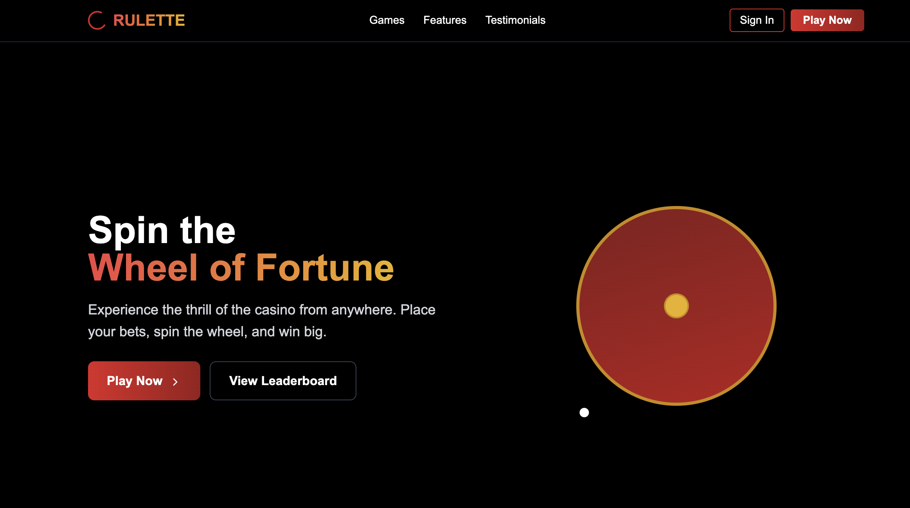
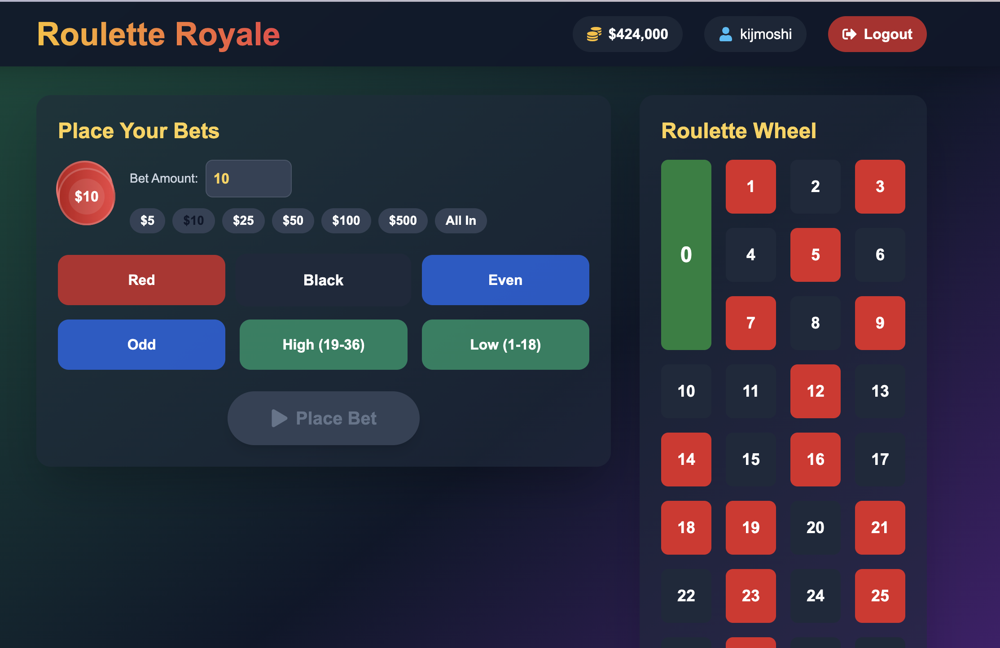

# Rulette 🎲 🎰

A modern web-based roulette game with real-time multiplayer features and leaderboard system. Spin to win! 🍀


## ✨ Features

- 🎮 Interactive roulette gameplay with realistic physics
- 🌐 Real-time multiplayer with live chat
- 🏆 Global leaderboard & achievements
- 📱 Responsive design for all devices
- 🔐 Secure user authentication
- 💰 Virtual currency & daily bonuses
- 🌙 Dark/Light mode support
- 🎵 Immersive sound effects

## 🖼️ Screenshots

<div align="center">
  
  
</div>

## 🛠️ Tech Stack

- **Framework**: Next.js 13 ⚡
- **Database**: MongoDB (via Mongoose) 🍃
- **Authentication**: NextAuth.js 🔑
- **Styling**: Tailwind CSS 🎨
- **Icons**: Lucide React 🎯
- **Animations**: Framer Motion 🎭

## 🚀 Getting Started

1. Clone the repository:
```bash
git clone https://github.com/real-kijmoshi/rulette.git
cd rulette
```

2. Install dependencies:
```bash
npm install
# or
yarn install
```

3. Set up environment variables:
```bash
cp .env.example .env.local
# Edit .env.local with your values
```

4. Start the development server:
```bash
npm run dev
# or
yarn dev
```

5. Open [http://localhost:3000](http://localhost:3000) in your browser 🌐

## 📁 Project Structure

```
rulette/
├── app/              # Next.js app directory
│   ├── api/         # API routes
│   ├── auth/        # Authentication pages
│   └── game/        # Game components
├── components/       # Reusable UI components
├── db/              # Database models
├── public/          # Static assets
└── styles/          # Global styles
```

## 🧪 Running Tests

```bash
npm run test
# or
yarn test
```

## 🤝 Contributing

Contributions are welcome! Please read our [Contributing Guide](CONTRIBUTING.md) first.

1. Fork the repository
2. Create your feature branch (`git checkout -b feature/amazing-feature`)
3. Commit your changes (`git commit -m 'Add some amazing feature'`)
4. Push to the branch (`git push origin feature/amazing-feature`)
5. Open a Pull Request

## ⭐ Show your support

Give a ⭐️ if this project helped you!

## ⚠️ Disclaimer

This is a demo project for educational purposes only. No real gambling or money is involved. Always gamble responsibly. 🎲